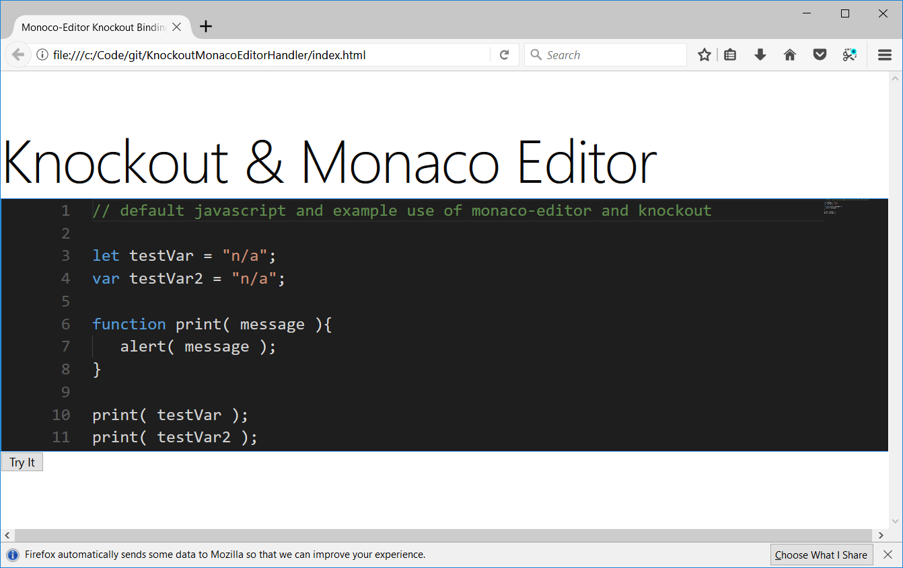
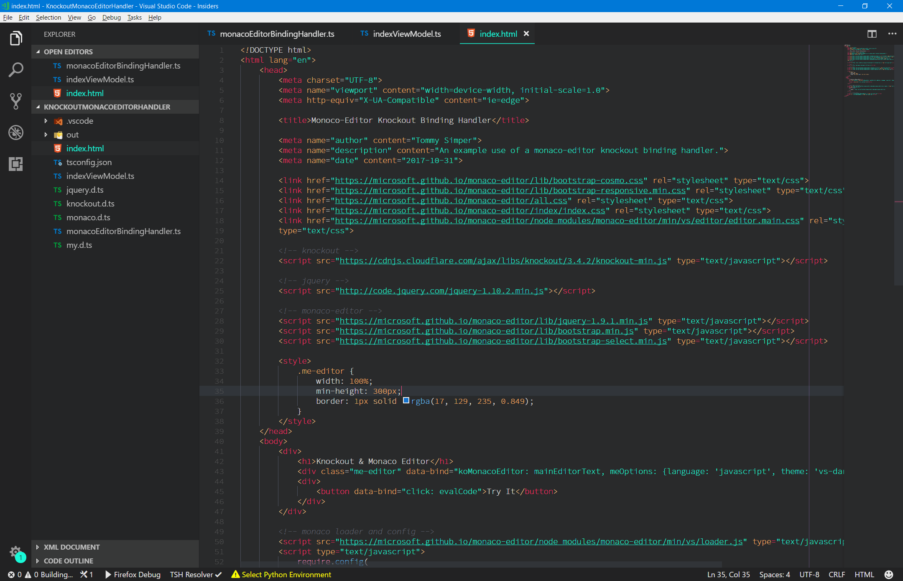

# A Knockout  binding handler for monaco-editor

*A simple example project that declares a knockout binding handler for monaco code editor for use in any environment.* 



>- The handler creates instances of the monaco editor in the browser. 
>- It allows all monaco-editor options declared in the data binding through a object literal called 'meOptions'.
>- This example does'nt use the monaco-editor npm package nor does it use node.
>- This example is purely client side and dynamically gets all monaco editor resources from the monaco github repo. 
>- The binding handler is written in typescript and it includes a store type collection for managing the editor instances.

## Getting Started
*It is pretty self explanatory if familiar with typescript but if not you just need to look up how to transpile typescript into javascript.*
- execute the tsconfig with tsc in order to generate the javascript files in the out directory. 
    - `tsc -p "projectRoot\tsconfig.json"`
- then launch the index.html in a browser

***if you are not interested in typescript and would like just the javascript you can transpile then just use the javascript.***

### data binding
```HTML
<div data-bind="koMonacoEditor: mainEditorText, 
                meOptions: {
                    language: 'javascript', 
                    theme: 'vs-dark', 
                    lineNumbers: 'on',
                    roundedSelection: true,
                    scrollBeyondLastLine: true,
                    fontSize: 20,
                    autoIndent: true,
                    folding: true,
                    mouseWheelZoom: true,
                    readOnly: true,
                    minimap: { 
                        enabled: false, 
                        showSlider: 'mouseover' 
                    }
                }" class="me-editor">
</div>
```

### code
All editor instances are persisted in a store that is attached to ko. 
```typescript
// create the editor instance store
ko.monacoEditors = new MonacoEditorStore();

// add the created custom binding handler to knockout's handler collection
ko.bindingHandlers.koMonacoEditor = new MonacoBindingHandlerHelper();
```

Therefore, if you need to reference a certain editor instance, just call into the store
```typescript
let someId = 'knockout-monaco-1';
var firstEditor: monaco.editor.ICodeEditor;

if ( ko.monacoEditors.hasEditors() )
    firstEditor = ko.monacoEditors.get( someId );

firstEditor.focus();
```

## More. . .
Not using monaco-editor module rather just loading required resources dynamically


NOTE: I have used monaco-editor is a few projects now and I have had the chance to use it purely client side like in the example as well using the node module. I defintely have noticed a performance difference between the two environments. I think the using the npm package allows the proper use of web workers which may dramatically improve performance.

I use the npm package in a NW.JS application and this envrionemnt comes with it's own quarks as the browser and node contexts require thought to program against since the monaco loader.js overwrites the global require variable. I found I had to store the require contents before loading monaco then I store the require in another variable ( say meRequire ) before setting global require back to the content I persisted before loading monaco.
